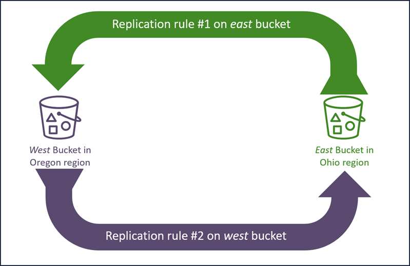
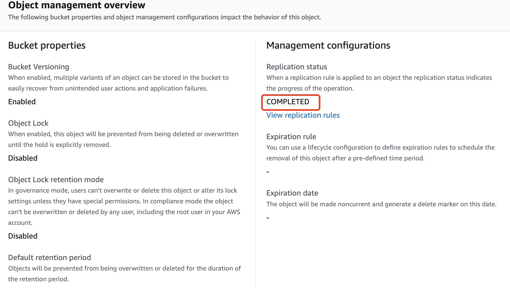
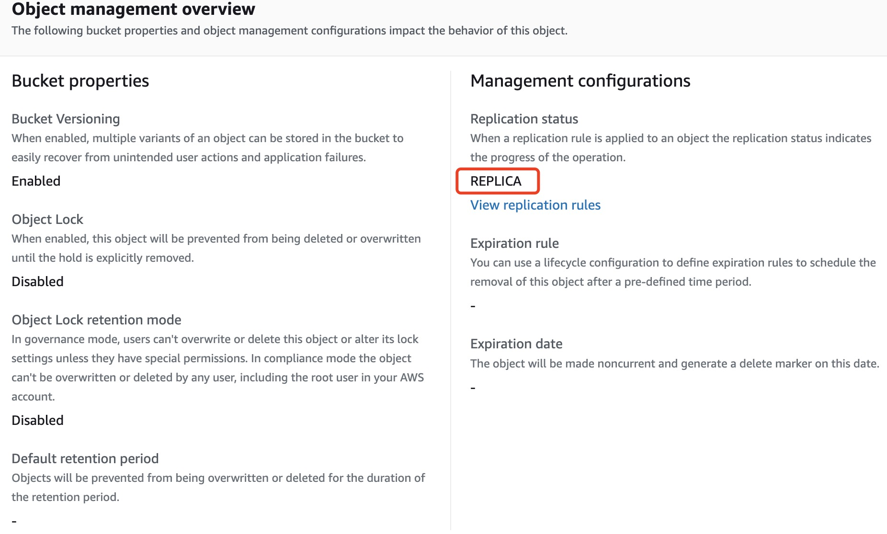

# Deploy AWS S3 Bi-directional Replication using Terraform

## Introduction  
This is a lab for deploying s3 bi-directional replication with Terraform. This backup skill can make your data be resilient and work automatically.  

If you don't know what is Terraform, you can refer to <https://registry.terraform.io/>. This lab refers to [AWS Well-Architected Labs](https://wellarchitectedlabs.com/), but I will accomplish it with Terraform.  
## Goals
- Perform data backup between two buckets in different aws region
- Use Terraform to make the deployment automatically  

## How-to
We will need two buckets with versioning enabled, which is a must for duplication job to work. The duplication work is done by S3 replication rule, and S3 buckets need a role with proper permission to duplicate objects between each other.  
So, we know that we need to create below resources:  
- S3 buckets with versioning enabled, regarding to the regions, I choose ap-east-1 (Hong Kong) and ap-southeast-1 (singapore).  
- Replication rule, as the rule is a configuration in buckets, you have to make sure the rule is created after the S3 buckets exist.
- Role with necessary policy, according to AWS document, we need least permission for S3 bucket to do the replication work on behalf of us.  
### Deployment
1. As we need to create S3 buckets in different regions, it's not like usual deployment to specify only one region in Terraform provider, we need to use below method to indicate two region in the same provider:

        terraform {
            required_providers {
                aws = {
                    source  = "hashicorp/aws"
                    version = "~> 3.72.0"
                }
            }
        }

        provider "aws" {
            alias  = "ap-east-1"
            region = "ap-east-1"
        }

        provider "aws" {
            alias  = "ap-southeast-1"
            region = "ap-southeast-1"
        }
You can quote the region with `aws.<alias>` in your s3 bucket resource and replication configuration resource.  
2. Create S3 bucket use `aws_s3_bucket` keyword, but remember to enable versioning.  
3. Create roles and policy, in aws, we need to specify the trusted entity to which the role assumes. In our lab, the entity is sure the S3 service. We also need to apply policy to the role, the permission we need can found in aws document <https://docs.aws.amazon.com/AmazonS3/latest/userguide/setting-repl-config-perm-overview.html>. While you search for documents in Terraform website, you will find multiple ways to create policy, but the recommended one is to use `aws_iam_policy_document`, the good point is that you can define a relatively long json policy and easy for writing, while not that good is that you will find it's ***hard to verify your policy correct or not***, sometimes just a typo in your policy may lead to entire project not work. So a good habit is to open your policy in aws iam access management after creation done, aws can verify the policy for you.  
4. Create replication rule use key word `aws_s3_bucket_replication_configuration`, you will define the rule block under the configuration resource, the required argument in the rule is `id`, `filter`, `status`, `destination`. The `filter` is to make the replication scope, which means you can specify part of your objects to be replicated to another bucket, or you empty it to identify all the objects within the bucket to be replicated. Of course, you have to specify the role be used, the bucket where the rule resides, the provider to indicate which region hold the resource.  

Once done for all the files, follow the steps in Terraform: `terraform init --> terraform plan --> terraform apply`.  

### Test
1. Upload the file "terraform.tfstate" to Hong Kong region bucket, you will find the same file appers in your singapore bucket.  

>When click the HK object, you will find the replication status COMPLETED 

 
>When click the Singapore object, you will find the application status REPLICA

2. Do the same opertion to upload a file in Singapore bucket first, if everything goes well, you will get your file in HK bucket.

